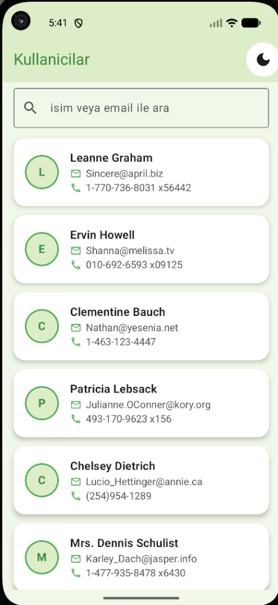
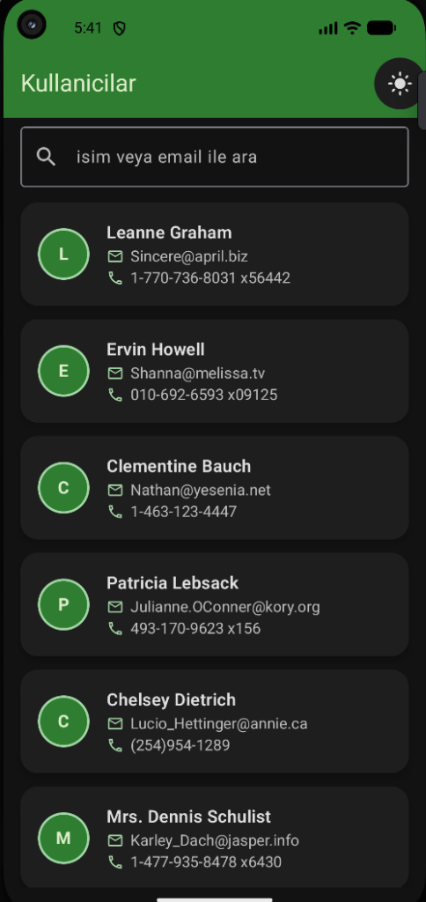
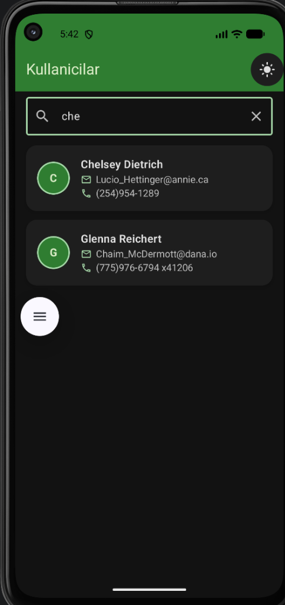

# UserDataHomework

JSONPlaceholder Users API uzerinden kullanici verisi ceken ve MVVM mimarisi ile gosteren bir Android uygulamasi.

## Kullanilan Teknolojiler

| Teknoloji | Aciklama |
|-----------|---------|
| **Kotlin** | Android gelistirme dili |
| **Jetpack Compose** | Modern UI toolkit |
| **Material 3** | Tasarim sistemi |
| **Retrofit 2.11.0** | HTTP istemci kutuphanesi |
| **Gson Converter** | JSON donusturucu |
| **Kotlin Coroutines** | Asenkron programlama |
| **StateFlow** | Reaktif state yonetimi |
| **Hilt 2.59.2** | Dependency Injection |
| **KSP 2.3.1** | Kotlin Symbol Processing |
| **ViewModel** | Lifecycle-aware veri yonetimi |

## Proje Yapisi (MVVM)

```
com.example.userdatahomework/
├── data/
│   ├── model/User.kt
│   ├── remote/ApiService.kt, RetrofitInstance.kt
│   └── repository/UserRepository.kt
├── di/AppModule.kt
├── ui/
│   ├── components/UserItem.kt
│   ├── screen/UserListScreen.kt
│   └── theme/Color.kt, Theme.kt, Type.kt
├── viewmodel/UserViewModel.kt
├── MainActivity.kt
└── UserApp.kt
```

## Ozellikler

- Kullanici listesi (LazyColumn)
- Dairesel avatar (ismin bas harfi)
- Email ve telefon ikonlari
- Loading / Success / Error state yonetimi
- Arama cubugu (isim veya email ile filtreleme)
- Pull-to-Refresh (asagi cekerek yenileme)
- Dark / Light mode gecisi
- Hilt ile Dependency Injection

## Kurulum

1. Projeyi klonlayin:
```bash
git clone <repo-url>
```

2. Android Studio ile acin.

3. Gradle sync islemini bekleyin.

4. Uygulamayi calistirin (Run > Run 'app') veya terminal uzerinden:
```bash
./gradlew assembleDebug
```

## API

- **Endpoint:** `https://jsonplaceholder.typicode.com/users`
- **Method:** GET
- **Response:** id, name, username, email, phone, website alanlari

## Gereksinimler

- Android Studio Meerkat (veya ustu)
- Min SDK: 24
- Target SDK: 36
- Internet baglantisi

## Ekran Goruntuleri

<div style="display: flex; gap: 10px;">
  
  
  
</div>
